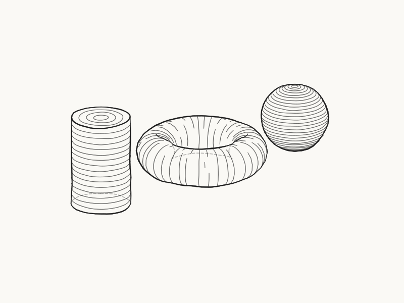

# Krbn

**I call it "Carbon", with the vowels sketched out.** A web engine for non-photorealistic,
pencil-style rendering of abstract and technical scenes — math and physics
constructions today, medical/organic illustration on the roadmap.

> **Building something?** See **[API.md](API.md)** — a short guide to using Krbn to build scenes and animations.


> **[See the full example gallery →](examples/README.md)** — multiple annotated
> renders, real STL/OBJ imports, and an animated camera orbit that stays calm
> (the hand-drawn lines don't boil).

## Why a pencil is a rendering problem

Most graphics code answers one question: _what color is this pixel?_ A pencil
drawing answers a different one: _which lines would an artist draw — and which
would they leave out?_ Krbn is built around that second question.

So it does not render surfaces. It derives, classifies, and styles **strokes**
from geometry. The silhouette of a sphere, a cylinder, a cone is not a mesh
edge found by sampling — it is an exact conic, computed in closed form; a torus
yields its true quartic. Hidden lines are not z-buffered away but split
analytically into visible and ghosted runs, the way a draftsman keeps the far
edge of a box alive as a faint line.

Even transparency works the way paper does. There is no alpha channel:
cross-hatching is inherently see-through, and the gaps between strokes reveal
what lies behind. Shading is hatch density; form is hatch _direction_, flowing
along each surface's own curvature — parallels and meridians on a sphere,
poloidal loops on a torus, traced streamlines on an arbitrary mesh.

Exactness is a project value, not an optimization. Intersections are roots of
low-degree polynomials; degenerate cases — tangent lines, coincident conics,
grazing cusps — are the spec, not edge cases. The payoff is output you can
trust: the same scene always emits the same, byte-identical, diffable SVG.

One more inversion: the author supplies _semantics_, the engine supplies
_mechanics_. You mark what matters — importance, focus, role — and Krbn decides
what to draw, what to ghost, and what to abstract away, like an illustrator
deciding what the figure is actually _about_.


It moves, too — and this is the part stills can't show: wobble is seeded on
stable stroke identity, so the hand-drawn lines **don't boil** between frames.
An orbiting camera slides the silhouettes; nothing shimmers, jumps, or re-deals
its jitter:



Krbn began as a research prototype and grew into a full pipeline: an analytic
primitive catalog and triangle meshes rendering through the _same_ five-stage
pass, with hidden-line visibility, suggestive contours, hand-drawn wobble, and
variable-width strokes. It is MIT-licensed and written in TypeScript — see the
full **[example gallery](examples/README.md)**, and open a discussion if this
problem space interests you.

## Genesis imperfecta

This project is a childhood dream, finally built. I always wanted to make
something like this, and never had the time to research and learn everything
it needed — until a recent medical issue suspended my normal work and,
unexpectedly, handed me a few months to invest in the old idea.

What fascinated me from the start is going _against_ photorealism. A human
being can convey far more **meaning** in a drawing than any machine-like
photorealistic render — precisely by being willing to go the other way: to
renounce detail, to drop precision, even to deliberately introduce impurities
and imperfections. Ah — but _which_ detail to drop? _Which_ imperfections to
introduce? That is the fascinating part, and it is the question this engine is
really trying to answer.

As a kid I wanted to call it _genesis imperfecta_, for exactly these reasons.
What can I say — I was a kid. The name matured into Krbn; the fascination
didn't.

## Disclaimer — built with AI, unapologetically

Krbn was developed with heavy AI assistance, and there is no reason to hide it.
It started as an experiment: how far could a carefully directed human–AI
collaboration get on a hard rendering problem? The answer turned out to be —
far. The direction, the architecture, and the standards (exactness as a value,
degenerate cases as the spec) are human; much of the code was written in
collaboration with AI, then reviewed and tested like any other code. The
results above speak for themselves.

> **Status & roadmap** live in one place, not here: **[`docs/ROADMAP.md`](docs/ROADMAP.md)**
> holds the annotated build status and polish backlog, and
> **[`docs/DESIGN.md`](docs/DESIGN.md)** holds the design, the implementation-status
> breakdown, and the hard-parts registry. This README stays high-level.

## Features

Each links to a demo in the [gallery](examples/README.md).

- **Analytic primitives** — sphere, ellipsoid, cylinder, cone, plane, polygon,
  line, points, and a torus, each with an _exact_ silhouette (conics; the torus a
  quartic). ([solids](examples/gallery/05-solid-shading.svg),
  [torus](examples/gallery/10-torus.svg))
- **Free-form curves** — helices, Bézier curves (carried exactly as control
  points), and function plots, sampled adaptively and occludable like anything else.
  ([curves](examples/gallery/17-parametric-curves.svg))
- **Triangle meshes** — arbitrary organic geometry renders through the _same_
  pipeline as the primitives, no fork: silhouette, shading, hidden-line, all shared.
  Sharp **creases** on faceted solids are permanent view-independent edges.
  ([knots](examples/gallery/15-mesh-showcase.svg),
  [creases](examples/gallery/18-creases.svg))
- **Exact hidden lines** — every contour is split into visible and hidden runs, the
  hidden parts either ghosted (x-ray) or dropped (opaque) so depth reads at a glance.
  Even points are occludable. ([hidden lines](examples/gallery/01-hidden-lines.svg),
  [ghost vs drop](examples/gallery/19-hidden-modes.svg))
- **Intersection curves** — where two surfaces meet (a ball through a plane, two
  quadrics), the seam is drawn as its own contour.
  ([waterline](examples/gallery/03-depth-hatching.svg),
  [quartic](examples/gallery/08-quartic.svg))
- **Suggestive contours** — the extra "form lines" an artist adds where a surface
  _almost_ turns away, read from mesh curvature (DeCarlo et al.).
  ([suggestive](examples/gallery/14-suggestive.svg))
- **Hatching & tone** — single / cross / triple cross-hatch, shaded **light→dark**
  on curved surfaces and left flat on flat faces.
  ([hatching](examples/gallery/02-hatching.svg))
- **Curvature-following hatch** — hatch that flows along a surface's own direction
  field: exact iso-curves on primitives, traced streamlines on meshes.
  ([fields](examples/gallery/12-direction-fields.svg),
  [gravity well](examples/gallery/16-gravity-well.svg))
- **Hand-drawn wobble** — one per-object knob turns ruler-clean lines sketchy; it
  bends outlines and hatch together and stays deterministic.
  ([wobble](examples/gallery/04-wobble.svg))
- **Variable stroke width** — solid lines are pencil-like ribbons: bolder when near
  or important, tapering and swelling with pressure toward the ends.
  ([torus](examples/gallery/10-torus.svg))
- **Abstraction** — detail too small to matter is dropped, tone is quantized, and
  coincident lines merge into one clean stroke.
  ([consolidation](examples/gallery/09-consolidation.svg))
- **Highlight** — x-ray emphasis: a bold outline inside a soft halo, dashed where
  something hides it. ([highlight](examples/gallery/06-highlight.svg))
- **Deterministic SVG** — pure, seeded vector output; the same scene always yields
  the same, diffable file.
- **Pen-plotter output** — `svg: { centerline: true }` emits every stroke as a
  single-line `<path>` centreline (no `<polyline>`, no filled ribbons), so the render
  goes straight to an SVG→G-code converter. ([API.md](API.md#pen-plotters))

## Why it works this way

- **Strokes are the core object.** Every visual requirement is a policy over the
  stroke set, not a shading model.
- **Transparency without alpha.** Cross-hatching is inherently see-through: the
  gaps reveal the ghosted hidden edges behind. Alpha is an optional later add.
- **Analytic primitives first.** For quadrics, silhouettes are exact conics and
  hidden-line visibility is exact — the hardest module is _easier_ here, not
  skipped. Triangle meshes then plug in behind the very same interface.
- **Author supplies semantics, engine supplies mechanics.** The developer marks
  what matters (importance/focus); the engine draws at the right level of detail.

## Architecture at a glance

A scene is a set of `FeatureSource`s. Each frame runs a five-stage pass:

1. **Feature extraction** — silhouettes, creases, boundaries, suggestive &
   intersection curves, plus hatch regions.
2. **Visibility classification** — split each curve into visible/hidden intervals.
3. **Abstraction filter** — drop sub-threshold detail, consolidate, apply importance.
4. **Styling** — weight, seeded wobble (lines + hatch), variable stroke width,
   dash, ghost, hatch density.
5. **Emit** — sample analytic curves and hand to the backend (SVG first).

Full detail, contracts, and the mesh/organ roadmap live in
[`docs/DESIGN.md`](docs/DESIGN.md). A short phase view is in [`docs/ROADMAP.md`](docs/ROADMAP.md).

## Project layout

```
src/
  math/        vectors, Mat3/Mat4, Basis, AABB, Camera + projection/unproject
  curve/       Curve / Curve2D carriers + exact conic kernel, root solvers, sampler
  pipeline/    contract types, visibility, styling (wobble/width/hatch), emit, render
  scene/       the FeatureSource seam + Scene / element / importance model
  primitives/  analytic primitives (Quadric→Sphere/Ellipsoid/Cylinder/Cone, Plane,
               Polygon, Line, ParametricCurve, Point, Torus)
  backend/     renderers — SVG (implemented)
  mesh/        deferred organ/mesh regime — see docs/DESIGN.md §3
examples/    runnable demos → *.svg (demo, styled, waterline)
docs/DESIGN.md the full design & roadmap
```

## Development

```bash
bun install
bun run typecheck
bun run build
bun test
```

## About the author

I like building things that run well; tools that make math visible. Krbn is an
open-source attempt; another is **[AhaBlitz](https://ahablitz.ro)** — a game
that helps Romanian students prepare for their math exams (Evaluare Națională,
Bacalaureat), built on hand-crafted simulators.

## License

MIT — see [`LICENSE`](LICENSE). Update the copyright holder to your name/org.
