# Examples

Runnable demos that render Krbn scenes to SVG. All output is deterministic
(wobble is seeded, no randomness), so the SVGs are stable and diffable. The
[gallery](#gallery) is a set of still renders, one per feature; the
[animation](#animation--temporal-coherence) is a frame sequence exercising the
temporal-coherence machinery end to end.

Two cross-cutting effects run through the whole gallery: the per-element **wobble**
knob bends both **outlines and hatch** (one hand knob per object), and solid strokes
are drawn as **variable-width ribbons** — a calligraphic end taper plus seeded
pencil pressure (both riding the wobble knob), over an always-on **depth emphasis**
that draws nearer contours bolder and receding ones thinner.

## Gallery

Run with:

```bash
bun run examples/gallery.ts
```

### 01 · Exact hidden-line visibility (stage 2)

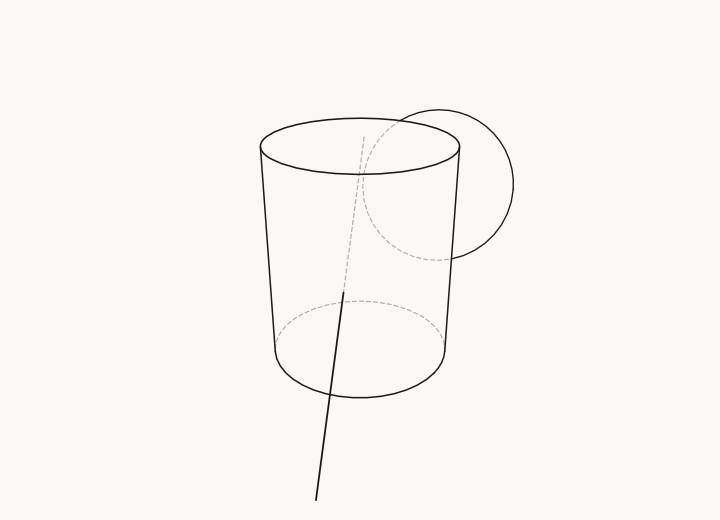

The cylinder's far rim halves are **dashed** (self-occlusion); the sphere's
silhouette is **solid where it juts past** the cylinder and **dashed where
hidden** behind it; the rod is dashed only where it passes through the body.
These are ruler-clean (`wobble: 0`), so the only weight variation is **depth
emphasis** — the nearer cylinder reads bolder than the receding sphere, and the
rod thins as it travels away.

### 02 · Hatching + tonal shading (stage 4)

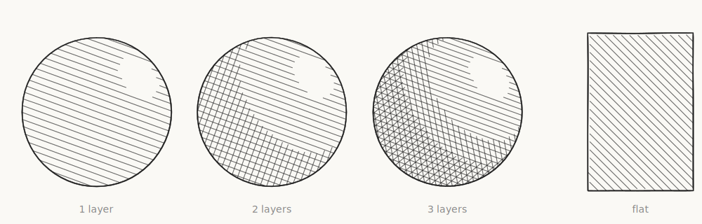

Three spheres — **1 / 2 / 3 layers** (single / cross / triple) — each shading
**light→dark** from a highlight into the shadow; the flat quad hatches
**uniformly** (constant normal).

### 03 · Hatching with depth + intersection curve

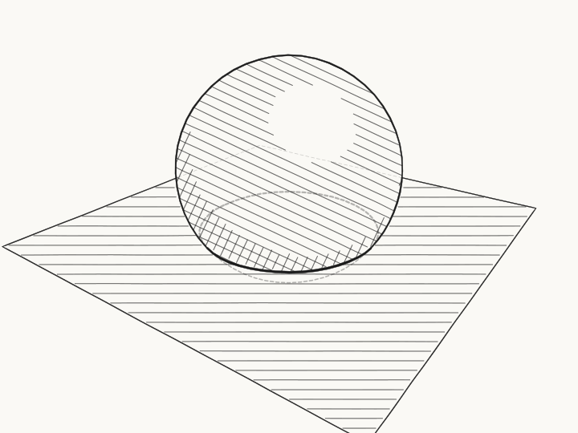

A ball half-submerged through a plane: the exact **waterline** (sphere ∩ plane)
is bold and **dashed on its hidden back arc**; the plane's hatch **stops where
the ball occludes it** (gaps reveal depth); hatch tone is quantized.

### 04 · Seeded coherent wobble

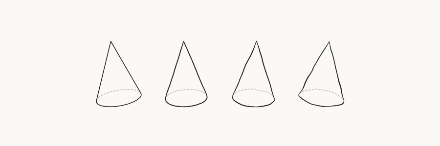

The same cone at wobble `0 → 1` (ruler → hand-drawn). At every amount the **apex
stays a single clean point** and rulings meet the rim exactly — the offset is a
seeded field keyed on the 3-D point, so strokes sharing a vertex join. As wobble
rises the lines also gain **pencil width** — a taper toward the ends and a seeded
pressure swell — since taper and pressure ride the same knob.

### 05 · Surface hatching on all quadric solids

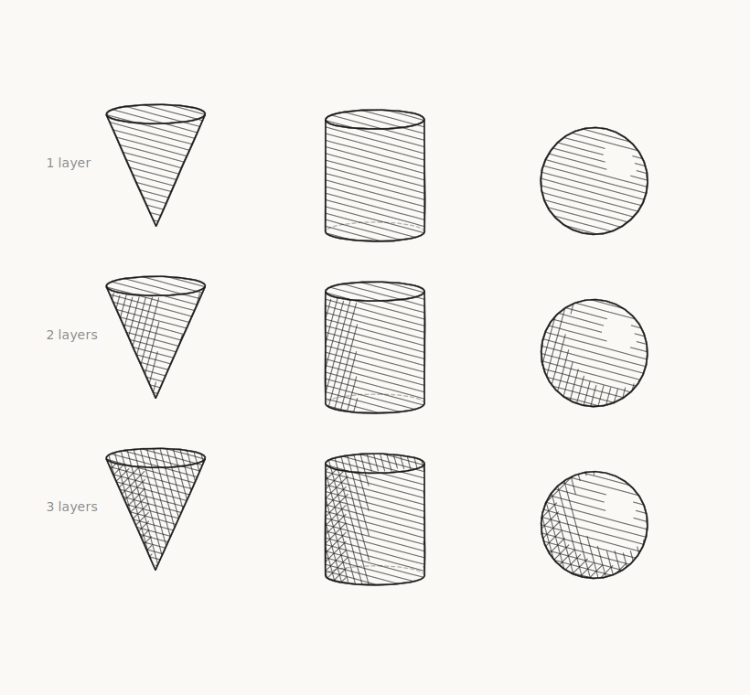

A 3×3 grid: **rows** are 1 / 2 / 3 layers (single / cross / triple), **columns**
are cone / cylinder / sphere. Each is surface-hatched and shaded **light→dark** —
adding layers deepens the tone. This is the **straight-parallel** baseline
(`hatch.field: false`); the curved direction field gets its own showcase in
[demo 12](#12--curved-hatch-direction-fields).

### 06 · `scene.highlight` (x-ray emphasis)

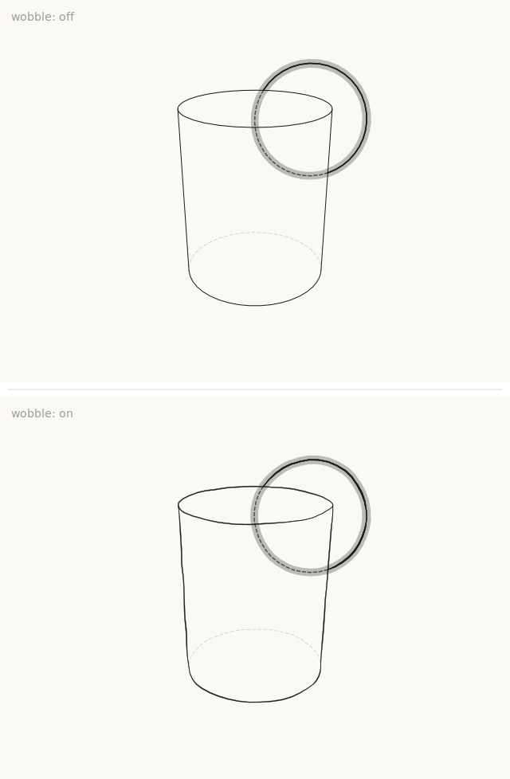

Two rows (**wobble off / on**). A sphere behind a cylinder, highlighted: a thin
crisp outline inside a thick **semi-transparent halo**, redrawn **on top**,
**solid where exposed** and **dashed where the cylinder hides it**.

### 07 · `Point` primitive

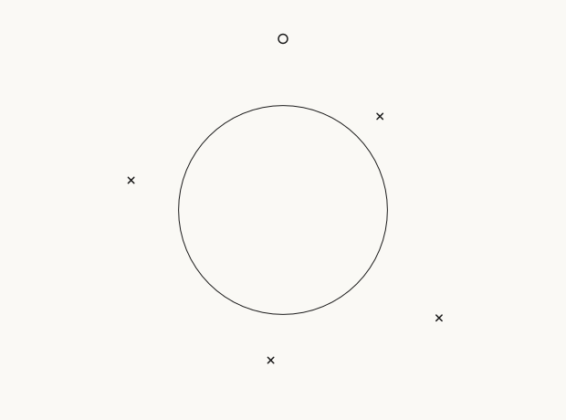

Camera-facing marks (× crosses and a dot ring), occludable like any feature — the
one behind the sphere is ghosted away.

### 08 · Quadric ∩ quadric quartic

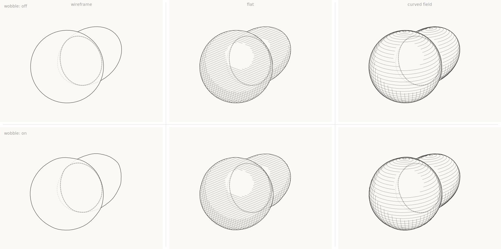

A 2×2 grid: **rows** are wobble off / on, **columns** are wireframe / shaded. An
ellipsoid meeting a sphere; their quartic intersection is traced (plane-sweep +
conic∩conic, Newton-refined) and drawn as a bold loop, **solid where visible,
dashed where behind** the surfaces. The shaded column hatches both quadrics (with
mutual occlusion) under the same intersection curve.

### 09 · Cross-primitive consolidation (off vs on)

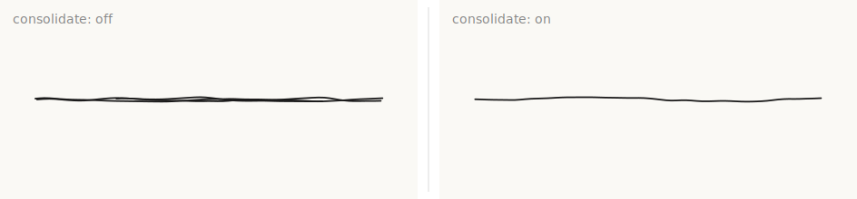

Three coincident wobbled rods. **Off**: different per-element seeds make them
weave into a tangle. **On**: they merge into one clean line
(`abstraction.consolidate`).

### 10 · Torus (the one non-quadric primitive)

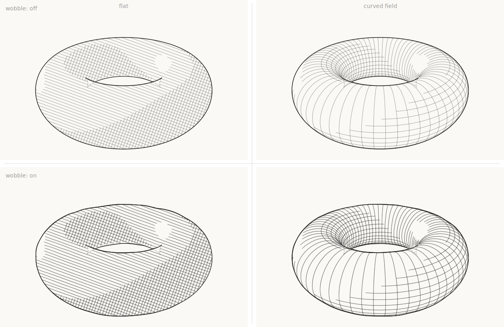

A 2×2 grid: **rows** are wobble off / on, **columns** are the **curved field** vs
**flat** parallel hatch. The torus silhouette is a **quartic** image curve,
extracted numerically from the implicit form as two contour loops (outer + hole).
The outer outline is solid; the hole rim is **solid on its near arc and dashed on
the far arc** where the tube hides it. Ray-torus is a genuine quartic. In the
curved column the tube is hatched along its **exact poloidal + toroidal direction
field** (§2.6) — the hatch lines are the surface's own iso-parameter circles, so
they wrap the tube and each one's hidden half drops out of the front-face +
occlusion test; the flat column (`hatch.field: false`) shows the same shading with
straight parallels for comparison. In the **wobble-on** row the hatch lines wobble
with the outlines (same hand knob), and the silhouette is a **variable-width
ribbon** — watch it swell and taper.

### 11 · Two interlocking toruses

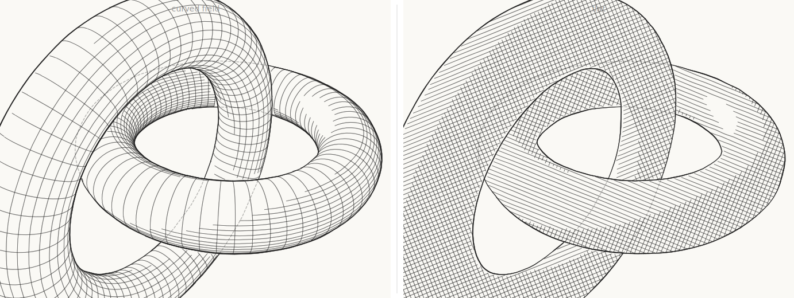

Two toruses threaded through each other like chain links, each cross-hatched and
wobbled — **curved field** (left) vs **flat** parallels (right). **Mutual
occlusion** falls straight out of the visibility stage — each torus dashes the
other's hidden silhouette and stops its hatch where the other is in front — so the
compound figure reads correctly with no special handling. The curved field makes
the linked tubes read as solid form; the flat hatch reads like a decal, which is
exactly why the field matters. Both are wobbled — hatch and outline alike — and the
silhouettes are **variable-width pencil ribbons**.

### 12 · Curved hatch direction fields

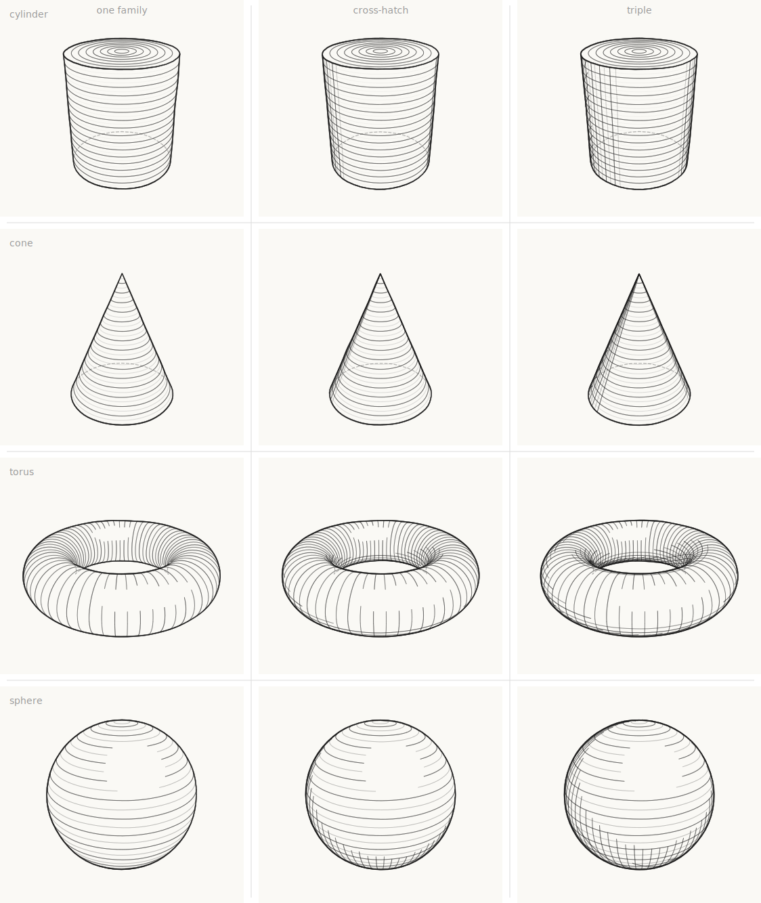

The hatch lines are the surface's **exact iso-parameter curves**, not straight
parallels. **Left**: one family (cylinder/cone rings, torus poloidal loops).
**Right**: cross-hatch — the second family added (axial rulings, apex generators,
toroidal loops). Each curve is drawn only where it is front-facing and unoccluded,
so its hidden half drops out of the same visibility test as everything else.

### 13 · Mesh regime (Phase 2)

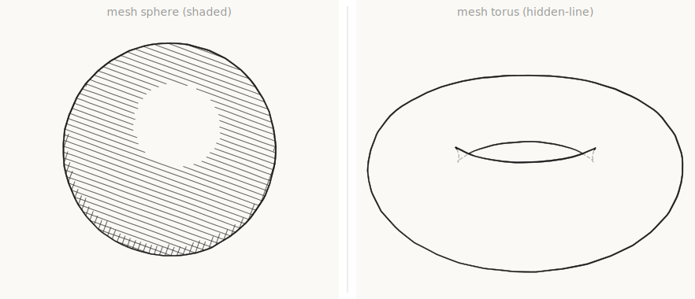

A triangle mesh is **just another `FeatureSource`**, so it renders through the very
same pipeline. **Left**: a smooth mesh sphere — its silhouette is an interpolated
zero-set (Hertzmann–Zorin) and it shades from the **interpolated vertex normals**.
**Right**: a mesh torus — the silhouette's near arcs are **solid** and the arcs
behind the tube are **dashed**, hidden-line falling straight out of the shared
visibility stage (Möller–Trumbore `raycast` + projected silhouettes). Wobble and
variable-width ribbons apply exactly as they do to the analytic primitives.

### 14 · Suggestive contours (Phase 2)

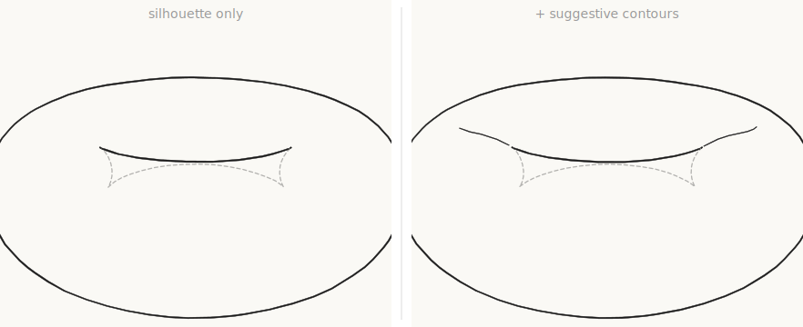

The extra lines an artist draws where the surface *almost* turns away —
**suggestive contours** (DeCarlo et al.): the zero-set of radial curvature on the
front-facing surface, where that curvature is increasing toward the eye. They come
from the mesh's curvature precompute (principal curvatures for κ_r, the derivative
tensor for the D_w κ_r test). **Left**: silhouette only. **Right**: with suggestive
contours added — the lighter form lines at the tube's inner shoulders that the true
silhouette leaves blank. Opt-in via `new Mesh(input, { suggestive })`; hidden
portions are dropped (not ghosted).

### 15 · Mesh showcase — two knotted tubes

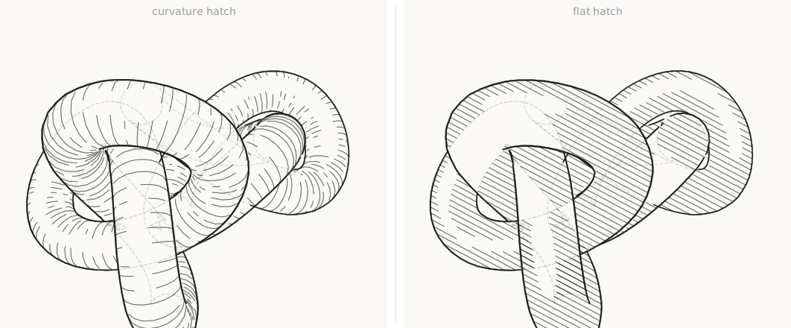

Two **trefoil-knot tubes** threaded through each other — arbitrary organic geometry,
not a primitive in sight. **Left**: each tube engraved with its **curvature-driven
hatch** (evenly-spaced streamlines of the principal-direction field wrap the tube
like a coil). **Right**: the same tubes with **flat** straight-parallel hatch, for
comparison. **Mutual occlusion** falls straight out of the shared visibility stage:
where one tube passes behind the other, its contour ghosts away. Wobble and
variable-width ribbons throughout — everything a triangle mesh does, through the
very same pipeline as the analytic primitives.

### 16 · Gravity well

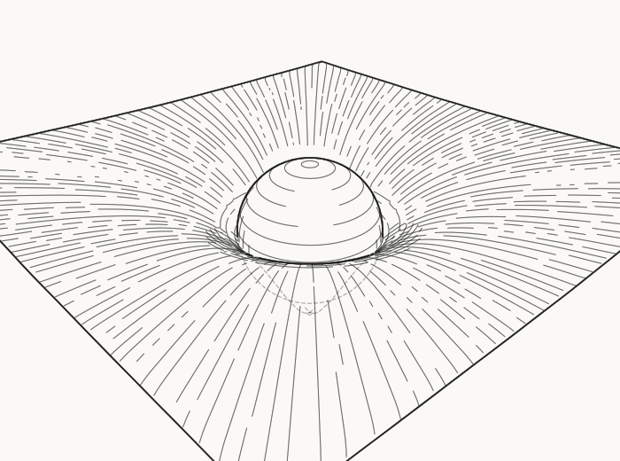

A heavy sphere resting in a dipped "rubber-sheet" plane — the usual way spacetime
curvature is drawn. The sheet is a **warped mesh**; because a funnel is a surface of
revolution, its **curvature-driven hatch** fans out as radial + concentric lines
(the principal directions), concentrated where the mass warps it and fading on the
flat outskirts. The sphere is an **analytic primitive** sitting in the dip, occluding
the well behind it — a mesh and a primitive mixed in one scene, classified by the
same visibility stage.

### 17 · Parametric curves

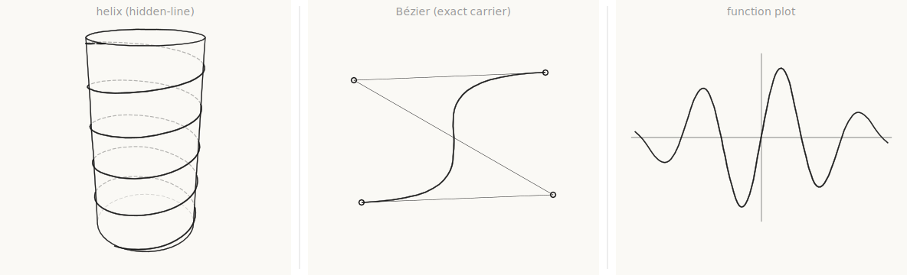

The free-form primitive — no closed-form silhouette, so it is the one place
per-frame **adaptive sampling** is sanctioned. **Left**: a **helix** wound just
outside a cylinder — a 1-D curve doesn't occlude, but it *is* occludable, so the
back of every turn is **dashed** where the cylinder hides it and the coil reads in
depth. **Middle**: a cubic **Bézier** carried *exactly* as its control points (the
faint control polygon + dots); the smooth curve threads an S the straight handles
can't fake, and it is only sampled to a polyline at emit. **Right**: a **function
plot** `y = g(x)`, a damped sine over an axis cross. The sampler carries a small
uniform floor (`minDepth`) so a curve that is symmetric about its centre can't
alias to a straight chord — a real hazard for oscillations and symmetric Béziers.

### 18 · Mesh creases (faceted solids)

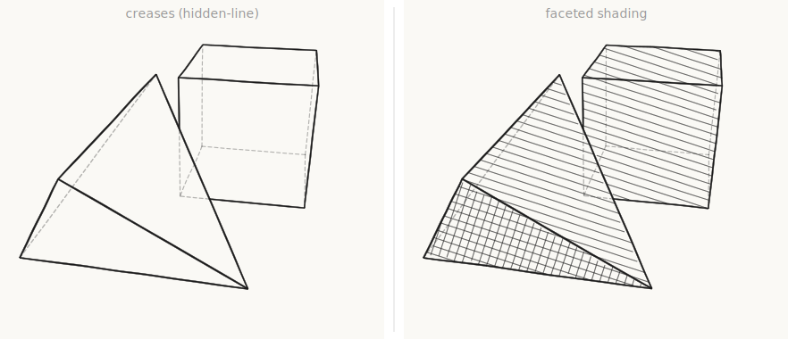

Where two facets meet above the crease angle, the shared edge is a **permanent,
view-independent feature** — unlike the silhouette, which slides across the surface
as the camera moves. A faceted **cube** (all 90° ridges) and **tetrahedron** (all
~70.5°): every edge is a crease. **Left**: creases + silhouette with hidden-line —
near edges **solid**, the three edges hiding behind each solid **dashed** (the
classic hidden-cube). **Right**: the same solids **flat-shaded** — each facet
hatches to a uniform tone set by its own orientation to the light, so the planes
read as facets. Creases come straight from the half-edge dihedral tags; no special
casing.

### 19 · Hidden lines — ghost vs drop

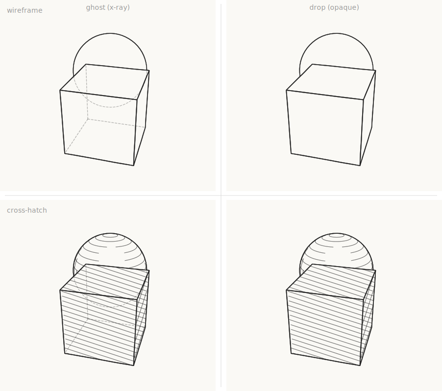

The same scene — a cube with a sphere behind it — under the two treatments of an
occluded contour, as **wireframe** (top) and **cross-hatch** (bottom). **Left,
`hidden: "ghost"`** (the default): hidden runs stay as faint dashes, an **x-ray**
reading where the cube's three back edges and the whole sphere show through — even
over the hatched faces — which is what a wireframe/technical drawing wants.
**Right, `hidden: "drop"`**: hidden runs are omitted, so the solids read as
**opaque** — the cube hides its own back edges and cleanly cuts the sphere's
outline. The visibility classification underneath is identical; only the styling of
the hidden intervals changes. Drop is what the [gravity well](#16--gravity-well)
uses, so an opaque surface doesn't ghost its own far side back through itself.

## Animation — temporal coherence

Run with:

```bash
bun run examples/animation.ts
```

Writes `animation/frame-000.svg … frame-047.svg` plus a one-file
**`animation/flipbook.html`** — open it in a browser and scrub or press play.
(The output directory is gitignored; regenerate at will. Like the gallery, the
sequence is deterministic: the same run always produces byte-identical frames.)

A 48-frame, 60° camera orbit of a mixed scene — a **mesh torus** (curvature
hatch + suggestive contours), an **analytic sphere** (cross-hatch), and a
**cylinder** (curved ring field) — rendered through a **`FrameSession`**, the
stateful wrapper that carries stroke identity across frames while the per-frame
pipeline stays pure (ai/DESIGN.md §3.3.7; ROADMAP Phase-2 item 6).

What to look for while it plays — each is one piece of the coherence work:

- **Silhouettes slide, never jump or flip.** Mesh contour chains are canonically
  oriented from geometry and matched frame-to-frame to session-lifetime
  persistent ids; the per-frame report (printed as the script runs) shows
  **zero born / died / reversed** over the whole orbit.
- **Hatch pans *with* the surfaces.** Straight hatch is phase-anchored to a
  projected object point; mesh streamlines come from a static object-space
  atlas; the analytic ring/ruling fields sit on dyadic iso-parameter ladders —
  the camera selects density, it never re-seeds or re-spaces.
- **Every line keeps its hand-drawn character.** Wobble seeds key on stable
  line identity (streamline id, ladder fraction, offset index), not emission
  order, so a visibility clip can't re-deal the jitter.
- **Detail thins by fading, never popping.** The abstraction cull, suggestive
  contours, and hatch LOD levels all dissolve through stateless opacity fades
  (`Stroke.fade`, `attrs.strength`, `HatchFieldCurve.fade`).

The matching property tests live in `test/animation-coherence.test.ts`: zero id
churn between adjacent frames, bounded per-step stroke displacement, steady
hatch volume, and byte-identical replays from fresh sessions.

## Rendering to PNG

SVGs open in any browser. To rasterize (e.g. for a README), use any SVG tool:

```bash
# ImageMagick, rsvg-convert, resvg, … — whatever you have
convert -background white -density 96 examples/gallery/03-depth-hatching.svg out.png
```
