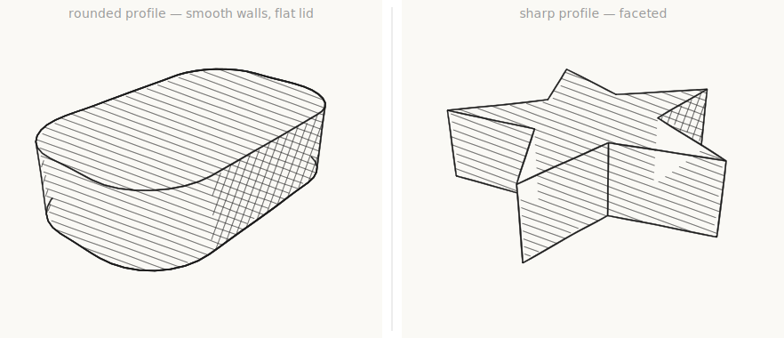
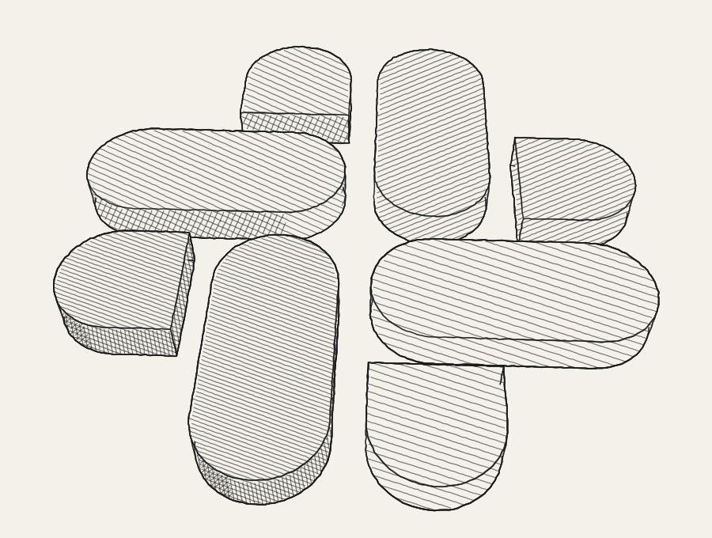
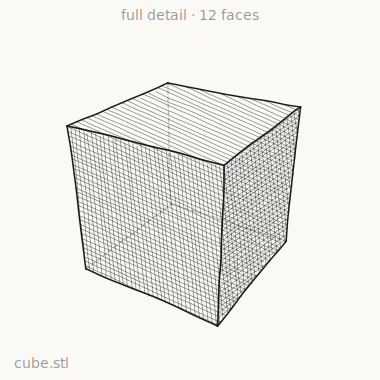
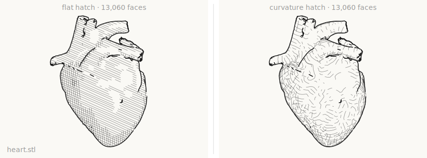
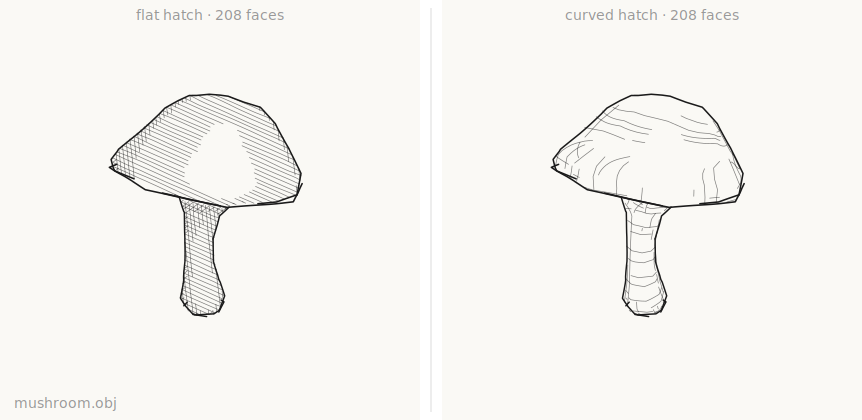
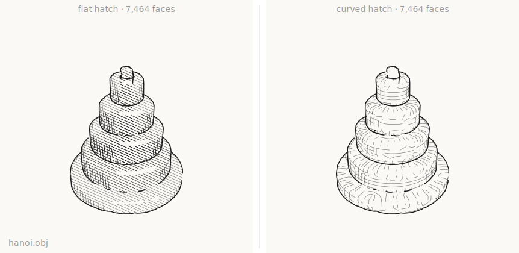
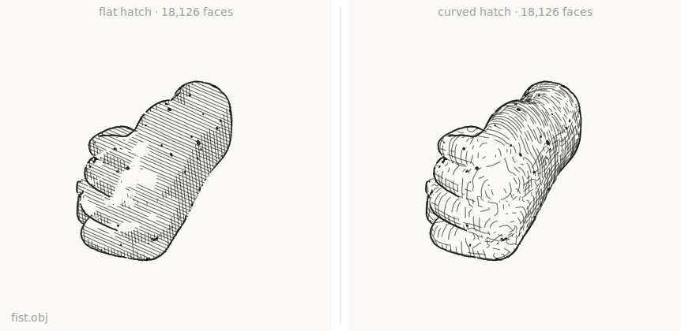

# Examples

Runnable demos that render Krbn scenes to SVG. All output is deterministic
(wobble is seeded, no randomness), so the SVGs are stable and diffable. The
[gallery](#gallery) is a set of still renders, one per feature; the
[importers](#importing-meshes--stl--obj) turn real STL and OBJ files into pencil
renders; the [animation](#animation--temporal-coherence) is a frame sequence
exercising the temporal-coherence machinery end to end.

Two cross-cutting effects run through the whole gallery: the per-element **wobble**
knob bends both **outlines and hatch** (one hand knob per object), and solid strokes
are drawn as **variable-width ribbons** — a calligraphic end taper plus seeded
pencil pressure (both riding the wobble knob), over an always-on **depth emphasis**
that draws nearer contours bolder and receding ones thinner.

## Gallery

Each demo is a standalone `*.krbn.ts` scene file in [`gallery/`](gallery) that
default-exports a `Drawing` (see [`src/layout`](../src/layout)). Render them all to
SVG — each written beside its source — with:

```bash
bun run render:gallery
```

or render one at a time:

```bash
bun run render examples/gallery/16-gravity-well.krbn.ts
```

Each file renders in its own process, so a scene is deterministic and
self-contained no matter how many are rendered together.

### 01 · Exact hidden-line visibility (stage 2)


The cylinder's far rim halves are **dashed** (self-occlusion); the sphere's
silhouette is **solid where it juts past** the cylinder and **dashed where
hidden** behind it; the rod is dashed only where it passes through the body.
These are ruler-clean (`wobble: 0`), so the only weight variation is **depth
emphasis** — each line segment is drawn thinner or bolder depending on how far
away it is from the camera, so the nearer cylinder reads bolder than the
receding sphere.

### 02 · Hatching + tonal shading (stage 4)


Three spheres — **1 / 2 / 3 layers** (single / cross / triple) — each shading
**light→dark** from a highlight into the shadow; the flat quad hatches
**uniformly** (constant normal).

### 03 · Hatching with depth + intersection curve


A ball half-submerged through a plane: the exact **waterline** (sphere ∩ plane)
is bold and **dashed on its hidden back arc**; the plane's hatch **stops where
the ball occludes it** (gaps reveal depth); hatch tone is quantized.

### 04 · Seeded coherent wobble


The same cone at wobble `0 → 1` (ruler → hand-drawn). At every amount the **apex
stays a single clean point** and rulings meet the rim exactly — the offset is a
seeded field keyed on the 3-D point, so strokes sharing a vertex join. As wobble
rises the lines also gain **pencil width** — a taper toward the ends and a seeded
pressure swell — since taper and pressure ride the same knob.

### 05 · Surface hatching on all quadric solids


A 3×3 grid: **rows** are 1 / 2 / 3 layers (single / cross / triple), **columns**
are cone / cylinder / sphere. Each is surface-hatched and shaded **light→dark** —
adding layers deepens the tone. This is the **straight-parallel** baseline
(`hatch.field: false`); the curved direction field gets its own showcase in
[demo 12](#12--curved-hatch-direction-fields).

### 06 · `scene.highlight` (x-ray emphasis)


Two rows (**wobble off / on**). A sphere behind a cylinder, highlighted: a thin
crisp outline inside a thick **semi-transparent halo**, redrawn **on top**,
**solid where exposed** and **dashed where the cylinder hides it**.

### 07 · `Point` primitive


Camera-facing marks (× crosses and a dot ring), occludable like any feature — the
one behind the sphere is ghosted away.

### 08 · Quadric ∩ quadric quartic


A 2×2 grid: **rows** are wobble off / on, **columns** are wireframe / shaded. An
ellipsoid meeting a sphere; their quartic intersection is traced (plane-sweep +
conic∩conic, Newton-refined) and drawn as a bold loop, **solid where visible,
dashed where behind** the surfaces. The shaded column hatches both quadrics (with
mutual occlusion) under the same intersection curve.

### 09 · Cross-primitive consolidation (off vs on)


Three coincident wobbled rods. **Off**: different per-element seeds make them
weave into a tangle. **On**: they merge into one clean line
(`abstraction.consolidate`).

### 10 · Torus (the one non-quadric primitive)


A 2×2 grid: **rows** are wobble off / on, **columns** are the **curved field** vs
**flat** parallel hatch. The torus silhouette is a **quartic** image curve,
extracted numerically from the implicit form as two contour loops (outer + hole).
The outer outline is solid; the hole rim is **solid on its near arc and dashed on
the far arc** where the tube hides it. Ray-torus is a genuine quartic. In the
curved column the tube is hatched along its **exact poloidal + toroidal direction
field** (§2.6) — the hatch lines are the surface's own iso-parameter circles, so
they wrap the tube and each one's hidden half drops out of the front-face +
occlusion test; the flat column (`hatch.field: false`) shows the same shading with
straight parallels for comparison. In the **wobble-on** row the hatch lines wobble
with the outlines (same hand knob), and the silhouette is a **variable-width
ribbon** — watch it swell and taper.

### 11 · Two interlocking toruses


Two toruses threaded through each other like chain links, each cross-hatched and
wobbled — **curved field** (left) vs **flat** parallels (right). **Mutual
occlusion** falls straight out of the visibility stage — each torus dashes the
other's hidden silhouette and stops its hatch where the other is in front — so the
compound figure reads correctly with no special handling. The curved field makes
the linked tubes read as solid form; the flat hatch reads like a decal, which is
exactly why the field matters. Both are wobbled — hatch and outline alike — and the
silhouettes are **variable-width pencil ribbons**.

### 12 · Curved hatch direction fields


The hatch lines are the surface's **exact iso-parameter curves**, not straight
parallels. **Left**: one family (cylinder/cone rings, torus poloidal loops).
**Right**: cross-hatch — the second family added (axial rulings, apex generators,
toroidal loops). Each curve is drawn only where it is front-facing and unoccluded,
so its hidden half drops out of the same visibility test as everything else.

### 13 · Mesh regime (Phase 2)


A triangle mesh is **just another `FeatureSource`**, so it renders through the very
same pipeline. **Left**: a smooth mesh sphere — its silhouette is an interpolated
zero-set (Hertzmann–Zorin) and it shades from the **interpolated vertex normals**.
**Right**: a mesh torus — the silhouette's near arcs are **solid** and the arcs
behind the tube are **dashed**, hidden-line falling straight out of the shared
visibility stage (Möller–Trumbore `raycast` + projected silhouettes). Wobble and
variable-width ribbons apply exactly as they do to the analytic primitives.

### 14 · Suggestive contours (Phase 2)


The extra lines an artist draws where the surface *almost* turns away —
**suggestive contours** (DeCarlo et al.): the zero-set of radial curvature on the
front-facing surface, where that curvature is increasing toward the eye. They come
from the mesh's curvature precompute (principal curvatures for κ_r, the derivative
tensor for the D_w κ_r test). **Left**: silhouette only. **Right**: with suggestive
contours added — the lighter form lines at the tube's inner shoulders that the true
silhouette leaves blank. Opt-in via `new Mesh(input, { suggestive })`; hidden
portions are dropped (not ghosted).

### 15 · Mesh showcase — two knotted tubes


Two **trefoil-knot tubes** threaded through each other — arbitrary organic geometry,
not a primitive in sight. **Left**: each tube engraved with its **curvature-driven
hatch** (evenly-spaced streamlines of the principal-direction field wrap the tube
like a coil). **Right**: the same tubes with **flat** straight-parallel hatch, for
comparison. **Mutual occlusion** falls straight out of the shared visibility stage:
where one tube passes behind the other, its contour ghosts away. Wobble and
variable-width ribbons throughout — everything a triangle mesh does, through the
very same pipeline as the analytic primitives.

### 16 · Gravity well


A heavy sphere resting in a dipped "rubber-sheet" plane — the usual way spacetime
curvature is drawn. The sheet is a **warped mesh**; because a funnel is a surface of
revolution, its **curvature-driven hatch** fans out as radial + concentric lines
(the principal directions), concentrated where the mass warps it and fading on the
flat outskirts. The sphere is an **analytic primitive** sitting in the dip, occluding
the well behind it — a mesh and a primitive mixed in one scene, classified by the
same visibility stage.

### 17 · Parametric curves


The free-form primitive — no closed-form silhouette, so it is the one place
per-frame **adaptive sampling** is sanctioned. **Left**: a **helix** wound just
outside a cylinder — a 1-D curve doesn't occlude, but it *is* occludable, so the
back of every turn is **dashed** where the cylinder hides it and the coil reads in
depth. **Middle**: a cubic **Bézier** carried *exactly* as its control points (the
faint control polygon + dots); the smooth curve threads an S the straight handles
can't fake, and it is only sampled to a polyline at emit. **Right**: a **function
plot** `y = g(x)`, a damped sine over an axis cross. The sampler carries a small
uniform floor (`minDepth`) so a curve that is symmetric about its centre can't
alias to a straight chord — a real hazard for oscillations and symmetric Béziers.

### 18 · Mesh creases (faceted solids)


Where two facets meet above the crease angle, the shared edge is a **permanent,
view-independent feature** — unlike the silhouette, which slides across the surface
as the camera moves. A faceted **cube** (all 90° ridges) and **tetrahedron** (all
~70.5°): every edge is a crease. **Left**: creases + silhouette with hidden-line —
near edges **solid**, the three edges hiding behind each solid **dashed** (the
classic hidden-cube). **Right**: the same solids **flat-shaded** — each facet
hatches to a uniform tone set by its own orientation to the light, so the planes
read as facets. Creases come straight from the half-edge dihedral tags; no special
casing.

### 19 · Hidden lines — ghost vs drop


The same scene — a cube with a sphere behind it — under the two treatments of an
occluded contour, as **wireframe** (top) and **cross-hatch** (bottom). **Left,
`hidden: "ghost"`** (the default): hidden runs stay as faint dashes, an **x-ray**
reading where the cube's three back edges and the whole sphere show through — even
over the hatched faces — which is what a wireframe/technical drawing wants.
**Right, `hidden: "drop"`**: hidden runs are omitted, so the solids read as
**opaque** — the cube hides its own back edges and cleanly cuts the sphere's
outline. The visibility classification underneath is identical; only the styling of
the hidden intervals changes. Drop is what the [gravity well](#16--gravity-well)
uses, so an opaque surface doesn't ghost its own far side back through itself.

### 20 · Extruded hard solids



A 2-D profile pushed to a height by **`extrude`** (`krbn/shapes`): a flat lid, a
flat floor, and one wall per edge, with the caps **ear-clipped** so non-convex
outlines work. Both panels are prisms; only the profile differs. **Left**, a
**rounded** rectangle — the corners are sampled finely, so the wall reads as one
**smooth curved band** while the **lid stays flat**. That mix is the point:
crease-aware corner normals shade the flat lid flat while the rounded wall shades
light→dark, instead of averaging the lid into a spurious dome. **Right**, a
**sharp** five-point star — every corner is a real crease, so the solid is
**faceted** and each flat wall takes a single tone by its angle to the light. One
generator, two regimes, chosen entirely by the profile.

### 21 · Capped solids in the wild — the Slack mark



The Slack mark rebuilt as its true geometry — four elongated **bar** capsules
pinwheeling around the central square plus four rounded **knob** caps — extruded to
eight rounded 3-D tiles laid flat on a sheet of paper. With no colour to work with,
the four brand hues map to four **hatch tones** (aubergine darkest → yellow
lightest). Every tile is a plain extrusion, and every tile is a **capped solid**:
a flat lid meeting a smooth wall at a 90° crease rim. So this is the [capped
regime](#20--extruded-hard-solids) doing its job with no per-scene help — the lids
shade flat (crease-aware corner normals) while the rounded walls shade smooth, the
drawn outline is the crease-aware silhouette (a clean curve, no phantom drifting
across the lid), and the hatch fills from the exact face contour so it clips to the
real rounded edges. The same eight tiles rendered as plain smooth meshes would dome
their lids and fray their edges.

## Importing meshes — STL & OBJ

Two scene files import real mesh files from [`importers/`](importers) and render
each to its own SVG. Render them both with:

```bash
bun run render:importers
```

The import path is two calls: a pure format decoder — **`parseSTL(bytes)`** or
**`parseOBJ(bytes)`** — that returns a full-detail `MeshInput`, then **`new
Mesh(input, { weldEps })`**, which renders through the very same pipeline as the
analytic primitives. Once the bytes are a `MeshInput`, nothing is format-specific:
hidden-line visibility, wobble, hatch, and creases all apply.

`weldEps` is the **decimation knob** — a coarser weld merges more vertices, so the
mesh gets lighter (faster to hidden-line, cleaner sketch, at the cost of fidelity).
That level is the caller's to choose, per model, never baked into the loader.

> ⚠️ **Importing meshes is early — expect to tinker.** This caveat is about
> *imported* files specifically: the analytic primitives are exact, but arbitrary
> real-world meshes are the young part of the engine, with a lot of refinement
> still ahead. A complex mesh will *not* render beautifully out of the box. Two
> knobs get you most of the way to a decent result, and finding the sweet spot is
> trial and error per model:
> - **`weldEps`** (decimation) — turn it up until the silhouette is clean and the
>   render is quick, down until you stop losing detail that matters.
> - **`creaseAngle`** (crease attenuation) — raise it to suppress the spurious
>   "creases" a decimated or noisy tessellation invents (they read as speckle all
>   over the surface); push it past π to turn creases off entirely for smooth /
>   organic scans, or keep it low to preserve genuine sharp edges (a cube, a
>   machined part). See how the demos in [`frame.ts`](importers/frame.ts) set both.

**These demos render with variable stroke width turned off**
(`variableWidth: false`): every line is a plain constant-weight polyline instead
of a filled ribbon. The reason is **pen plotters** — a ribbon is a closed outline
that a plotter traces around (drawing every line twice), while a plain polyline
is a true single stroke, one pen pass. It also avoids the blobby self-intersection
artifacts ribbons can produce on dense mesh silhouettes. The hand-drawn wobble is
unaffected; opt back into ribbons per scene or per model with
`variableWidth: true`.

Most panels below are a **side-by-side comparison of the two hatch modes** on the
same geometry: **flat** straight parallels vs the surface's **curvature-driven
field** (streamlines of the principal-direction field that wrap the form). Same
shape, same tone — only the stroke *flow* differs, and the curved field is what
makes a surface read as solid rather than decal-flat.

### STL — [`stl.krbn.ts`](importers/stl.krbn.ts)

**`parseSTL`** auto-detects binary vs ASCII (by the exact size formula, *not* the
header — binary files often start with `solid` too), repairs each triangle's winding
against its stored facet normal, and returns unwelded triangle soup, so `weldEps`
fuses the shared corners back.

A tiny watertight **cube** — full detail (12 facets), faceted triple hatch, back
edges dashed by the hidden-line stage:



An anatomical **heart** shown flat vs curvature hatch — the streamlines pool around
the lobes and vessels where flat parallels stay blind to the form:



### OBJ — [`obj.krbn.ts`](importers/obj.krbn.ts)

**`parseOBJ`** reads the geometry subset (`v`/`f`, all index forms, negative
indices, fan-triangulated quads/n-gons). OBJ already ships a *shared* vertex table,
so topology comes for free — no weld needed to reconstruct it.

A low-poly **mushroom** (208 faces), a **Tower of Hanoi** stack, and an organic
**fist** scan — the curved field wraps the cap, the turned discs, and the knuckles
as rings and flow lines, while the flat hatch stays uniformly diagonal:







> The sample meshes are third-party fixtures; they're input data, not Krbn artifacts.

## Animation — temporal coherence


*(This is a pre-rendered GIF of the sequence below — see
[Encoding the animation to video / GIF](#encoding-the-animation-to-video--gif)
to reproduce it.)*

`animation.krbn.ts` default-exports a `film(...)` — a sequence of frames, each an
ordinary `Drawing` (here `raw(session.render(cam).svg)`), so a frame composes with
the same helpers as a still. Render it with:

```bash
bun run render:animation
```

Writes `animation/frame-000.svg … frame-059.svg` plus an
**`animation/flipbook.html`** viewer that references those frame files — open it in
a browser and scrub or press play.
(The output directory is gitignored; regenerate at will. Like the gallery, the
sequence is deterministic: the same run always produces byte-identical frames.)

A 48-frame, 60° camera orbit of a mixed scene — a **mesh torus** (curvature
hatch + suggestive contours), an **analytic sphere** (cross-hatch), and a
**cylinder** (curved ring field) — rendered through a **`FrameSession`**, the
stateful wrapper that carries stroke identity across frames while the per-frame
pipeline stays pure (docs/DESIGN.md §3.3.7; ROADMAP Phase-2 item 6).

What to look for while it plays — each is one piece of the coherence work:

- **Silhouettes slide, never jump or flip.** Mesh contour chains are canonically
  oriented from geometry and matched frame-to-frame to session-lifetime
  persistent ids; the per-frame report (printed as the script runs) shows
  **zero born / died / reversed** over the whole orbit.
- **Hatch pans *with* the surfaces.** Straight hatch is phase-anchored to a
  projected object point; mesh streamlines come from a static object-space
  atlas; the analytic ring/ruling fields sit on dyadic iso-parameter ladders —
  the camera selects density, it never re-seeds or re-spaces.
- **Every line keeps its hand-drawn character.** Wobble seeds key on stable
  line identity (streamline id, ladder fraction, offset index), not emission
  order, so a visibility clip can't re-deal the jitter.
- **Feature detail thins by fading, never popping.** The abstraction cull and
  suggestive contours dissolve through stateless opacity fades (`Stroke.fade`,
  `attrs.strength`). Hatch density is the one deliberate exception: it snaps
  between *complete* dyadic levels (a partially-drawn interleaving level reads
  as a periodic banding artifact in stills), and the level demand is
  rotation-invariant, so an orbit never triggers a switch.

The matching property tests live in `test/animation-coherence.test.ts`: zero id
churn between adjacent frames, bounded per-step stroke displacement, steady
hatch volume, and byte-identical replays from fresh sessions.

## Rendering to PNG

SVGs open in any browser. To rasterize (e.g. for a README or a social post), use
any SVG tool — `rsvg-convert` (Homebrew: `brew install librsvg`) is the least
fuss:

```bash
rsvg-convert -w 1600 examples/gallery/16-gravity-well.svg -o gravity-well.png

# or a whole folder:
for f in examples/gallery/*.svg; do rsvg-convert -w 1600 "$f" -o "${f%.svg}.png"; done
```

Width sets the scale; height follows. Add `-b '#faf9f5'` (the paper color) if
the target composites transparent PNGs badly. ImageMagick's `convert` and
`resvg` work too.

## Encoding the animation to video / GIF

The frame SVGs are large — that's fine: **vector is the source format, not the
shipping format.** Rasterize the frames and encode; pencil-style line art
(mostly paper, thin dark strokes) compresses very well, so a clip lands at a
few MB.

```bash
bun run render:animation

# rasterize every frame
for f in examples/animation/frame-*.svg; do
  rsvg-convert -w 800 -b '#faf9f5' "$f" -o "${f%.svg}.png"
done

# mp4 (LinkedIn/Reddit native video, or drag into a GitHub comment to embed)
ffmpeg -framerate 24 -pattern_type glob -i 'examples/animation/frame-*.png' \
  -c:v libx264 -pix_fmt yuv420p -crf 20 krbn-animation.mp4

# GIF (autoplays inline in a README — keep it short and modest or it balloons)
ffmpeg -framerate 15 -pattern_type glob -i 'examples/animation/frame-*.png' \
  -vf "scale=800:-1:flags=lanczos,split[s0][s1];[s0]palettegen[p];[s1][p]paletteuse" \
  krbn-animation.gif
```

The thing to watch (and to mention if you share it): the wobble is seeded on
stable stroke identity, so the hand-drawn lines **don't boil** between frames —
the coherence that `test/animation-coherence.test.ts` asserts is exactly what
makes the clip look calm.
